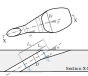

# CoolEffNet - Predicting Film Cooling Effectiveness with Neural Networks

CoolEffNet is a set of tools written in Python for predicting film cooling effectiveness
in flat plate experiments, using a technique called
[Bayesian Neural Network Ensembles](https://doi.org/10.48550/arXiv.1811.12188).
A set of pre-trained ensembles are included along with a tool to train your own network ensembles on custom data and save them.
The mean prediction of the included networks have 19-36% less root-mean-squared error compared to
using Colban's and Baldauf's correlations over the same dataset.
A technical report detailing the model and its advantages will be hopefully available in time.

## Links

- [Installation](#installation)
- [Usage](#usage)
    - [Examples from the command-line](#examples-from-the-command-line)
    - [Examples using Python code](#examples-using-python-code)
    - [Possible parameters](#possible-parameters)
    - [Options](#options)

## Installation

Installation is done via `pip`.
Using your favourite shell, enter: 

`pip install cooleffnet`

## Usage

`cooleffnet` is the predictor tool, and `cooleffnet-train` is the tool for training ensembles.
Both have large variety of options and an extensive help accessible via the `-h` and `--help` options.

### Examples using the command-line

#### CoolEffNet

First let us get some information about the default model.

```bash
$ cooleffnet --info
Model path: <_io.BytesIO object at 0x7fe6212e3650>
Model params: {'no_models': 10, 'in_features': 7, 'layers': [100, 1], 'noise_variance': 0.00032399999999999996, 'dropout_prob': None}
Expected flow parameters: ['AR', 'W/P', 'P/D', 'BR', 'IR', 'ER']
X normalisation: log
Expected normalisation parameters: None
Input normalisation mean: tensor([[1.9569, 0.3697, 4.6299, 1.3508, 2.0636, 1.3237, 2.5596]])
Input normalisation std. dev: tensor([[1.0280, 0.1393, 1.4023, 1.0330, 4.0978, 1.0256, 0.9730]])
```
This shows that the default model ("general") uses an ensemble of 10 Bayesian neural networks,
each with a single hidden layer of 100 nodes and uses a noise variance of 3.24E-4.
It expects 6 input parameters: area ratio, width over pitch, pitch over diameter, blowing ratio, impulse ratio and 
advective capacity ratio. 
Refer to the [full list of what each flow parameter means](#possible-parameters) for more details.

Now that we know which parameters the model requires, we can use it to predict the film cooling effectiveness.

##### Using specific $x/D$ values
Assume we are interested in the $x/D$ of 1, 2, 3, 4, 5 and 10 and the parameters
mentioned above are all 1.0 (this is to provide a simple example, and may not represent a real case)

```bash
$ cooleffnet --x-vals=1,2,3,4,5,10 --params=1.0,1.0,1.0,1.0,1.0,1.0
x/D       Film eff. CI lower  CI upper  
----------------------------------------
1.0000    0.3889    0.0000    0.8590    
2.0000    0.4218    0.0287    0.8148    
3.0000    0.4420    0.1006    0.7835    
4.0000    0.4508    0.1357    0.7658    
5.0000    0.4557    0.1567    0.7547    
10.0000   0.4529    0.1728    0.7331 
```
The second column shows the mean prediction, while the third and fourth 
show the lower and upper boundary of the 95% confidence interval.

##### Equally spaced $x/D$ values
If you require results at many $x/D$ values then the above approach may be cumbersome.
You can use the `--x-lin START,STOP,NUM` option which inputs `NUM` $x/D$ values between `START` and 
`STOP` similarly to how the `linspace()` function of NumPy or PyTorch works. 
Say we are interested in 10 points 1.0 $\leq x/D \leq$ 10.0.
```bash
$ cooleffnet --x-lin=1.0,10.0,10 --params=1.0,1.0,1.0,1.0,1.0,1.0
x/D       Film eff. CI lower  CI upper  
----------------------------------------
1.0000    0.3889    0.0000    0.8590    
2.0000    0.4218    0.0287    0.8148    
3.0000    0.4420    0.1006    0.7835    
4.0000    0.4508    0.1357    0.7658    
5.0000    0.4557    0.1567    0.7547    
6.0000    0.4588    0.1731    0.7444    
7.0000    0.4587    0.1785    0.7390    
8.0000    0.4567    0.1783    0.7351    
9.0000    0.4556    0.1757    0.7355    
10.0000   0.4529    0.1728    0.7331  
```

##### Using a different model
If you want to use a different model then specify the name of the model
or the path to the model file generated by `cooleffnet-train` after the options.

Using the `general` model (which is the default if nothing is specified)
```bash
$ cooleffnet --x-vals=1 --params=1.0,1.0,1.0,1.0,1.0,1.0 general
x/D       Film eff. CI lower  CI upper
----------------------------------------
1.0000    0.3889    0.0000    0.8590
```
The other pre-trained network available is called `specific` as it uses more input parameters.
To see which ones, run  `cooleffnet --info specific`

For a user-made model you could run:
```bash
$ cooleffnet --x-vals=1.0,2.0 --params=<YOUR PARAMETERS> /path/to/your/model.pth
```
Again, it may be useful to run `cooleffnet --info /path/to/your/model.pth` first.

##### Save output to file

You may want to save the output to a file instead of viewing it in the shell.
Use the `-o OUTPUT_FILE` option to achieve this. For example
```bash
$ cooleffnet --x-lin=1,10,10 --params=1,1,1,1,1,1 -o /path/to/your/output/file
```

##### JSON or CSV output
The default output is good for human readability, but often the data needs to be imported
into some other program. To facilitate this JSON and CSV output options are also provided
using the `--format={json,csv,plain}` option.
```bash
$ cooleffnet --x-lin=1.0,10.0,10 --params=1.0,1.0,1.0,1.0,1.0,1.0 --format=csv
x/D,Film effectiveness,CI lower,CI upper
1.0,0.38885265588760376,0.0,0.8590147495269775
2.0,0.4217924177646637,0.02873969078063965,0.8148451447486877
3.0,0.4420401453971863,0.10060116648674011,0.7834790945053101
4.0,0.4507569372653961,0.13573989272117615,0.7657740116119385
5.0,0.455716997385025,0.1567421555519104,0.7546918392181396
6.0,0.45877307653427124,0.17314425110816956,0.7444019317626953
7.0,0.45874547958374023,0.17846861481666565,0.7390223741531372
8.0,0.4567038416862488,0.17827335000038147,0.7351343631744385
9.0,0.45560020208358765,0.17571702599525452,0.7354834079742432
10.0,0.4529324471950531,0.17278942465782166,0.7330754995346069```

```
```bash
$ cooleffnet --x-lin=1.0,10.0,10 --params=1.0,1.0,1.0,1.0,1.0,1.0 --format=json
{
    "x_d": [
        1.0,
        2.0,
        3.0,
        4.0,
        5.0,
        6.0,
        7.0,
        8.0,
        9.0,
        10.0
    ],
    "eff": [
        0.38885265588760376,
        0.4217924177646637,
        0.4420401453971863,
        0.4507569372653961,
        0.455716997385025,
        0.45877307653427124,
        0.45874547958374023,
        0.4567038416862488,
        0.45560020208358765,
        0.4529324471950531
    ],
    "ci_lower": [
        0.0,
        0.02873969078063965,
        0.10060116648674011,
        0.13573989272117615,
        0.1567421555519104,
        0.17314425110816956,
        0.17846861481666565,
        0.17827335000038147,
        0.17571702599525452,
        0.17278942465782166
    ],
    "ci_upper": [
        0.8590147495269775,
        0.8148451447486877,
        0.7834790945053101,
        0.7657740116119385,
        0.7546918392181396,
        0.7444019317626953,
        0.7390223741531372,
        0.7351343631744385,
        0.7354834079742432,
        0.7330754995346069
    ]
}
```
##### Further options
There are more options available, for details either run `cooleffnet --help` or refer to [Options](#options)

### Examples using Python code

The package also functions as a Python library and  film cooling predictions can be 
embedded inside Python code.

Using the general model: 
```python
import torch
from cooleffnet.predictor import CoolingPredictor

flow_params = torch.FloatTensor([1.0, 1.0, 1.0, 1.0, 1.0, 1.0])
x_vals = torch.linspace(1.0, 10.0, 10)

pred = CoolingPredictor("general")
print(pred)

eff_mean, (upper, lower) = pred(flow_params, x_vals)
print(eff_mean)
print(upper)
print(lower)
```
Output:
```python
Model path: <_io.BytesIO object at 0x7f5d0c61c4f0>
Model params: {'no_models': 10, 'in_features': 7, 'layers': [100, 1], 'noise_variance': 0.00032399999999999996, 'dropout_prob': None}
Expected flow parameters: ['AR', 'W/P', 'P/D', 'BR', 'IR', 'ER']
X normalisation: log
Expected normalisation parameters: None
Input normalisation mean: tensor([[1.9569, 0.3697, 4.6299, 1.3508, 2.0636, 1.3237, 2.5596]])
Input normalisation std. dev: tensor([[1.0280, 0.1393, 1.4023, 1.0330, 4.0978, 1.0256, 0.9730]])

tensor([[0.3889],
        [0.4218],
        [0.4420],
        [0.4508],
        [0.4557],
        [0.4588],
        [0.4587],
        [0.4567],
        [0.4556],
        [0.4529]])
tensor([[0.8590],
        [0.8148],
        [0.7835],
        [0.7658],
        [0.7547],
        [0.7444],
        [0.7390],
        [0.7351],
        [0.7355],
        [0.7331]])
tensor([[0.0000],
        [0.0287],
        [0.1006],
        [0.1357],
        [0.1567],
        [0.1731],
        [0.1785],
        [0.1783],
        [0.1757],
        [0.1728]])

```
Many of the options available from the command-line are also available in code.
Please refer to the docstrings in `cooleffnet/predictor.py` for more details.

#### CoolEffNet-Train

CoolEffNet-Train is the tool which was used to train the neural networks included
in CoolEffNet. It can be used to train networks on your own datasets, potentially
improving the performane of the network ensemble even further. 
Please note that CoolEffNet-Train is a development tool, and while it is released to
the public in this repository, it is not as user-friendly as CoolEffNet and it is structured
in a way that was convenient for the developers and it may contain less helpful error messages and warnings.
Pull requests improving this are very welcome.
Nevertheless, the code has detailed docstrings in `cooleffnet/cooleffnet_train.py` and
some basic examples are provided here to get you started. 

First, you need a database of measurements. The one used to generate the `general` and `specific`
models included use the one in the `data/` folder. 
Each JSON file in the directory correspond to a single figure of an academic paper. 
It may contain several $x/D$ - film effectiveness curves, though one limitation is that
one file may contain only one combination of fluids. For more details on how the
data files are structured please see the existing examples in the folder and the [Databases document.](DATABASES.md)

CoolEffNet-Train can be launched with `cooleffnet-train`. You likely need to specify
the directory where your measurement JSON files are located using the `-d DIRECTORY` option.
The default directory is the current working directory.
Then CoolEffNet-Train can do three kinds of training, each has its own option. If multiple are specified
they are run one after another
* `--export` - Trains the ensemble using the entire dataset and saves the network to a file
* `--cv [K]` - `K`-fold cross validation on the entire dataset. Default `K` is 5. 
* `--holdout` - Trains on a random subset of the dataset and tests on the holdout group.

Then the parameters to be used in the input layer need to be given using the 
`--params PARAMS` argument. Refer to the [full list of possible parameters.](#possible-parameters)
A log file about the training is saved about each training run for future reference.
There are various options to configure the training process, though the defaults are reasonable.
For details refer to the [full list of options.](#cooleffnet-train-1)
##### Creating a model to use in `cooleffnet`

Assume all measurements are in the `data/` folder. 
```bash
$ cooleffnet-train -d=data --export -o=yourmodel.pth
Using cpu device
Using variables ['AR', 'W/D', 'P/D', 'IR', 'BR', 'ER']
Running for 100 epochs, with network layers: [100, 1]

Training on all data in dataset to export & save model
Training model #1
Training model #2
Training model #3
Training model #4
Training model #5
Training model #6
Training model #7
Training model #8
Training model #9
Training model #10
Training loss root-MSE: 0.03205139935016632
```
This saves the trained network to the file `yourmodel.pth`. 

##### Custom network parameters 

You can fine-tune the parameters of the networks in the ensemble.
E.g. the following uses an ensemble of 7 networks, each having 2 hidden layers with 50 nodes each.
```bash
$ cooleffnet-train -d=data --export -o=yourmodel.pth --no-models 7 --nodes 50 --hidden=2
Using cpu device
Using variables ['AR', 'W/D', 'P/D', 'IR', 'BR', 'ER']
Running for 100 epochs, with network layers: [50, 50, 1]

Training on all data in dataset to export & save model
Training model #1
Training model #2
Training model #3
Training model #4
Training model #5
Training model #6
Training model #7
Training loss root-MSE: 0.028433576226234436
```

##### Custom learning parameters
You can configure the learning rate, the batch size, the number of epochs 
and the input parameters as well using the relevant options.

```bash
$ cooleffnet-train -d=ddata --export -o=yourmodel.pth -e 100 --lr 0.0001 --batch-size 150 --params=AR,DR,IR,W_D,P_D,alpha
Using cpu device
Using variables ['AR', 'DR', 'IR', 'W_D', 'P_D', 'alpha']
Running for 100 epochs, with network layers: [100, 1]

Training on all data in dataset to export & save model
Training model #1

[...]
```
This uses a learning rate of 0.0001 over 100 epochs with a batch size of 150.
The parameters used are the area ratio, the density ratio, the momentum flux ratio
, width to diameter ratio, pitch to diameter ratio and the inclination angle. 

##### Cross-validation 

```bash
$ cooleffnet-train -d data --cv 5
Using cpu device
Using variables ['AR', 'W/D', 'P/D', 'IR', 'BR', 'ER']
Running for 100 epochs, with network layers: [100, 1]

Running 5-fold cross-validation
----- 100/01 nodes -----
Training model #1
Training model #2
Training model #3
Training model #4
Training model #5
Training model #6
Training model #7
Training model #8
Training model #9
Training model #10
----- 100/02 nodes -----
Training model #1
Training model #2

[...]

100/05 nodes, avg. training score: 0.0331 σ = 0.00116, avg. test score: 0.059 σ = 0.0172
All training scores: [0.033409234136343, 0.03181647136807442, 0.03456484526395798, 0.03408440202474594, 0.03122926503419876]
All test scores: [0.08272775262594223, 0.07875929027795792, 0.04251845180988312, 0.0479888916015625, 0.05018442124128342]
Average feature importances: {'Area ratio': -0.15961632132530212, 'Coverage ratio': 0.0870686024427414, 'Pitch to diameter ratio': 0.1649085134267807, 'Momentum flux ratio': 0.25092458724975586, 'Blowing ratio': 0.037732649594545364, 'Advective capacity ratio': -0.0896567851305008, 'Horizontal distance': 0.17432598769664764}
Std. deviation of feature importances: {'Area ratio': 0.08737105131149292, 'Coverage ratio': 0.021830983459949493, 'Pitch to diameter ratio': 0.05903942137956619, 'Momentum flux ratio': 0.009792736731469631, 'Blowing ratio': 0.07529408484697342, 'Advective capacity ratio': 0.047356124967336655, 'Horizontal distance': 0.06551730632781982}
```
This does 5-fold cross validation on the dataset given. 

##### Further options

There are a few other options available, for plotting the loss curves or
the actual results when using a test set via the `--holdout` option, filtering
holes based on whether they are cylindrical or shaped, transforming the $x/D$ coordinates
and more. Refer to the [full list of options](#cooleffnet-train-1) for more details. 

### Possible parameters

| Parameter short name | Expression                                        | Description                                                    |
|----------------------|---------------------------------------------------|----------------------------------------------------------------|
| `AR`                 | $AR$                                              | Exit-to-inlet cross-sectional area ratio for coolant           |
| `W_D`                | $\frac{W}{D}$                                     | Hole width to diameter ratio (coverage ratio)                  |
| `W_P`                | $\frac{W}{P}$                                     | Hole width to hole pitch ratio                                 |
| `P_D`                | $\frac{P}{D}$                                     | Hole pitch to diameter ratio                                   |
| `L_D`                | $\frac{L}{D}$                                     | Coolant hole centerline length to hole diameter ratio          |
| `Alpha`              | $\alpha$                                          | Inclination angle of coolant hole, see diagram below.          |
| `Beta`               | $\beta$                                           | Orientation/compound angle of coolant hole, see diagram below. |
| `Re`                 | $Re$                                              | Coolant Reynold number                                         |
| `Ma`                 | $Ma$                                              | Coolant Mach number                                            |
| `Tu`                 | $Tu$                                              | Mainstream  turbulence intensity                               |
| `VR`                 | $VR$                                              | Coolant-to-mainstream velocity ratio                           |
| `BR`                 | $BR = \frac{\rho_c V_c}{\rho_\infty V_\infty}$    | Blowing ratio                                                  |
| `BR_normal`          | $BR \sin(\alpha)$                                 | Normal component of the blowing ratio"                         |
| `BR_perpendicular`   | $BR \sin(\beta)$                                  | Perpendicular component of blowing ratio"                      |
| `DR`                 | $DR = \frac{\rho_c}{\rho_\infty}$                 | Coolant-to-mainstream density ratio"                           |
| `IR`                 | $IR = \frac{\rho_c V^2_c}{\rho_\infty V^2_\infty}$ | Coolant-to-mainstream momentum flux ratio"                     |
| `IR_eff`             | $IR/AR^2$                                         | Effective coolant-to-mainstream momentum flux ratio"           |
| `IR_normal`          | $IR \sin(\alpha)$                                 | Normal component of the momentum flux ratio"                   |
| `IR_perpendicular`   | $IR \sin(\beta)$                                  | Perpendicular component of the momentum flux ratio"            |
| `ER`                 | $BR \frac{c_{p,c}}{c_{p,\infty}}$                 | Coolant-to-mainstream advective capacity ratio"                |
| `TR`                 | $\frac{T_c}{T_\infty}$                            | Coolant-to-mainstream temperature ratio"                       |
| `Single_hole`        | -                                                 | 1 if single hole, -1 if multiple holes                         |

Reference for geometric parameters:



### Options

#### `cooleffnet`

Usage: 
```bash
cooleffnet [required named arguments] [options] [model name/file]
```
##### Required named arguments:

| Required arguments       | Description                                                                                                                   |
|--------------------------|-------------------------------------------------------------------------------------------------------------------------------|
| `--x-vals=XVALS`         | Either this or `--x-lin` needs to be specified. Comma separated values of the flow parameters requried by the model.          |
| `--x-lin=START,STOP,NUM` | Either this or `--x-vals` needs to be specified. Inputs `NUM` amount of $x/D$ values between `START` and `STOP` to the model. |
| `--params=PARAMS`        | Comma separated values of flow parameters as required by the model                                                            |

##### Options:
| Option | Description                                                                                                                                                                                                         |
| ------ |---------------------------------------------------------------------------------------------------------------------------------------------------------------------------------------------------------------------|
| `-h`, `--help` | Shows help                                                                                                                                                                                                          |
| `--info` | Shows information about the model, like how many and what kind of flow parameters it requires                                                                                                                       |
| `--norm-params` | Some custom models may require extra parameters not included in `--params` for transforrmation of $x/D$ values                                                                                                      |
| `--plot` | Plot result using MatPlotLib                                                                                                                                                                                        |
| `--format={json,csv,plain}` | Sets the output format to JSON, CSV or plaintext                                                                                                                                                                    |
| `-o OUTPUT`, `--output OUTPUT` | Save output to file instead of printing it in the shell                                                                                                                                                             |
| ``-no-ci`` | Removes the 95% confidence interval from the output                                                                                                                                                                 |
| `--no-clip` | The 95% confidence interval, when confidence is low, may occasionally be outside the range of [0.0, 1.0]. As these values are not physical they are clipped to this range by default. Use this option to avoid that |

##### Model
Optionally specify the model. The default one is called `general` and has predicted 
film effectiveness well in cross-validation tests.
The slightly better `specific` model is also available, but it may not generalise well to
inputs outside the training range.
Alternatively user-generated models from `cooleffnet-train` may be used well by specifying the path.
See the [examples](#examples-using-the-command-line). 

#### `cooleffnet-train`

##### Usage

While all options are optional due to the default values, but in practice
you would run it someway like this: 
```bash
cooleffnet-train -d=<database dir> [--export | --holdout | --cv [CV]] [options] 
```

| Option                          | Description                                                                                                                                                                       |
|---------------------------------|-----------------------------------------------------------------------------------------------------------------------------------------------------------------------------------|
| `-h`, `--help`                  | Shows the help                                                                                                                                                                    |
| `-d DIR`, `--directory DIR`     | Directory containing the measurement JSON files                                                                                                                                   |
| `--loss`                        | Shows the loss curves for each model in the ensemble after training                                                                                                               |
| `--plot`                        | Plots the predicted values of the ensemble for the test set (only for `--holdout`                                                                                                 |
| `--prior`                       | Shows a true vs. predicted plot for the test set before training (only for `--holdout`                                                                                            |
| `--export`                      | Trains ensemble using the entire dataset and saves it to a file                                                                                                                   |
| `-o OUTPUT`, `--output OUTPUT`  | Sets the output file path (only for `--export`)                                                                                                                                   |
| `--holdout`                     | Trains ensemble using a subset of the dataset then tests it on the holdout group                                                                                                  |
| `--training-min NUM`            | Minimum number of datapoints in training set (only in `--holdout`)                                                                                                                |
| `--test-min NUM`                | Minimum number of datapoints in test set (only in `--holdout`)                                                                                                                    |
| `-e EPOCHS`, `--epochs EPOCHS`  | Number of epochs to use when training a network in the ensemble                                                                                                                   |
| `-n NODES`, `--nodes NODES`     | Number of nodes in each hidden layers                                                                                                                                             |
| `--no-models NO_MODELS`         | Number of models in ensemble                                                                                                                                                      |
| `--noise`                       | Magnitude of noise in the dataset                                                                                                                                                 | 
| `--hidden NO_HIDDEN`            | Number of hidden layers                                                                                                                                                           | 
| `--xnorm {log,reciprocal}`      | Optional transformation of $x/D$ values. If `log` used then $\ln(x/D)$ is used as input instead of $x/D$. If `reciprocal` is selected, then $ER/(\frac{P}{D} \cdot x/D)$ is used. |
| `--conv-limit LIMIT`            | Maximum mean squared loss a network can have to be considered as converged                                                                                                        |
| `--batch-size SIZE`             | Batch size to use when training a network in the ensemble                                                                                                                         |
| `--lr LR`                       | Learning rate to use when training a network in the ensemble                                                                                                                      |
| `--cv [CV]`                     | Do `CV`-fold cross-validation on the dataset. If `CV` is not specified then 5-fold cross-validation is done.                                                                      |
| `--comment`                     | Comment about the training run. Displayed in the plots and in the logfile.                                                                                                        |
| `--filter {cylindrical,shaped}` | Optional filter for the dataset. If `cylindrical` is set then only cylindrical holes are used. Similarly, if `shaped` is set then only shaped holes are included.                 |
| `--params PARAMS`               | Comma separated values of the parameters to use as input parameters. See the [full parameter list](#possible-parameters) for options.                                             |
