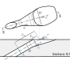

# Whittle Laboratory Film Cooling Database

This repository contains a database of flat plate film cooling effectiveness
measurements, and associated documentation.

## Reading material

* [Bogard and Thole (2006)](https://doi.org/10.2514/1.18034): review paper with
  good background information, but second half (VII. Airfoils and Endwalls;
  VIII. CFD Predictions) not so relevant for us.
* [Taylor et al. (2019)](https://doi.org/10.1115/1.4046658): paper from the
  Whittle Lab applying machine learning to compressor measurements.
* [Fischer et al. (2020)](https://doi.org/10.1115/1.4046544): scaling of film cooling experiments with different coolant gases.
* [Ornano and Povey (2020)](https://doi.org/10.1115/1.4046277): a 
  comprehensive study on the choice of non-dimensional groups to characterise
  film cooling. A bit dense but some useful insights.
* [scikit-learn
  documentation](https://scikit-learn.org/stable/user_guide.html): one choice
  of machine learning library. We are most interested in Gaussian processes but
  could try other methods as well. Lots of tutorial/examples available
  elsewhere.
* *Bayesian ensemble neural networks*
    - [Pearce et al. (2018)](https://doi.org/10.48550/arXiv.1811.12188): Theoretical background to the method.
    - [Sengupta et al. (2021)](https://doi.org/10.1115/1.4049762): Application with code on his GitHub.
* *Correlations for film effectiveness* with implementations in `correlations.py`
    - [Baldauf et al.](https://doi.org/10.1115/1.1504443): cylindrical cooling holes.
    - [Colban et al. (2011)](https://doi.org/10.1115/1.4002064): shaped cooling holes only.

## Geometry definitions



The largest cross-section that is fully enclosed by the hole, labelled $A\_\*$,
over the metering section area $A_\mathrm{c}=\pi D^2 / 4$,
defines the area ratio. In terms of diffusion lengths and angles,

```math
    \mathit{AR} = \frac{A_*}{A_\mathrm{c}} = 1 + \frac{4}{\pi} \left[
        \left( 2 \frac{L_\phi^*}{D} \tan \phi + 1 \right)
        \left(\frac{L_\psi^*}{D} \tan \psi + 1 \right) - 1
    \right]\,,\label{eqn:AR}\\
```
with,
```math
    \frac{L_\phi^*}{D} = \frac{L_\phi}{D} - \frac{1}{2\tan\alpha}\,,\quad
    \frac{L_\psi^*}{D} = \frac{L_\psi}{D} - \frac{1}{2\tan\alpha}\,. \nonumber
```

The width of the hole breakout at the hole axis defines the coverage width,
$W$, which normalised by the hole pitch gives a coverage ratio $W/P$. The
coverage ratio only depends on the lateral expansion parameters and the
pitch-to-diameter ratio,

```math
    \frac{W}{P} = \frac{1}{P/D}\left(1 + 2\frac{L_\phi}{D}\tan \phi\right)\,.
    \label{eqn:W_P}
```

See `util.py` for an implementation of these formulae.

## File format

There is one JSON file per published figure.

The root JSON object has keys:
* `geometry`
* `dimensional`
* `flow`
* `metadata`
* `distributions`
each of which has nested fields given below.

*Geometry*
| JSON field | Symbol | Units | Description |
| ---------- | ------------ | ----- | ----------- |
| `is_single_hole` | - | - | `True` if a single hole, `False` if periodic row |
| `alpha` | $\alpha$ | deg | Hole inclination angle |
| `beta` | $\beta$ | deg | Hole compound angle |
| `phi` | $\phi$ | deg | Hole lateral diffusion half angle |
| `psi` | $\psi$ | deg | Hole forward diffusion full angle |
| `Lphi_D` | $L_\phi/D$ | - | Hole lateral diffusion length |
| `Lpsi_D` | $L_\psi/D$ | - | Hole forward diffusion length |
| `is_x_origin_trailing_edge` | - | - | `True` if $x=0$ at hole trailing edge, `False` if $x=0$ at hole center |

*Dimensional*
| JSON field | Symbol | Units | Description |
| ---------- | ------------ | ----- | ----------- |
| `Vinf` | $V_\infty$ | m/s | Main-stream velocity |
| `Tc` | $T_\mathrm{c}$ | K | Coolant temperature |
| `Tinf` | $T_\infty$ | K | Main-stream temperature |
| `D` | $D$ | m | Hole diameter |

*Flow*
| JSON field | Symbol | Units | Description |
| ---------- | ------------ | ----- | ----------- |
| `DR` | $\mathit{DR}$ | - | Density ratio |
| `BR` | $\mathit{BR}$ | - | Blowing ratio |
| `Tu` | $\mathit{Tu}$ | % | Main-stream turbulence intensity|
| `del_D` | $\delta/D$ | - | Boundary layer displacement thickness |
| `Lam_D` | $\Lambda/D$ | - | Main-stream turbulence integral length scale |
| `H` | $H$ | - | Boundary layer shape factor |
| `Reinf` | $\mathit{Re}\_\infty$ | - | Main-stream Reynolds number |
| `Mainf` | $\mathit{Ma}\_\infty$ | - | Main-stream Mach number |
| `coolant` | - | - | String for coolant gas, e.g. `CO2` |
| `mainstream` | - | - | String for main-stream gas, e.g. `Air` |

*Metadata*
| JSON field | Symbol | Units | Description |
| ---------- | ------------ | ----- | ----------- |
| `doi` | - | - | URL for digital object identifier of publication |
| `ref` | - | - | Short key for publication author and year, e.g. `Smith2000` |
| `fig` | - | - | Figure reference within the publication, e.g. `Fig8a` |
| `comment` | - | - | Human-readable comment on this database entry |
| `uncertainty_eff_abs` | $\delta \varepsilon$ | - | Typical measurement uncertainty in film effectiveness |

*Distributions*
| JSON field | Symbol | Units | Description |
| ---------- | ------------ | ----- | ----------- |
| `x_D` | $x/D$ | - |  List of streamwise coordinates for measurement locations |
| `eff` | $\varepsilon$ | - | List of effectiveness values at the measurement locations |

## Notes on calculating non-dimensionals

* There is one JSON file per published figure. 
* If field takes a list of values, then the file contains data for multiple
  lines on the same axes (or a list of lists for *distributions*).
* Only one of $T_\mathrm{c}$ and $T_\infty$ are given, depending on what is
  specified in the description of experimental apparatus in the publication.
* Either $V_\infty$ for incompressible experiments, or $Ma_\infty$
  for compressible flows is specified.
* Assume $p_\infty \approx p_\mathrm{c}$ for density calculation.
* We can get gas properties using the [CoolProp library](http://www.coolprop.org/coolprop/wrappers/Python/index.html#python) like this:
```python
from CoolProp import CoolProp
T = 300.
P = 1e5
fluid_name = "Air"
# Constant
Mair = CoolProp.PropsSI("molar_mass", fluid_name)
# Function of temperature and pressure
cpair = CoolProp.PropsSI("Cp0mass", "T", T, "P", P, fluid_name)
cvair = CoolProp.PropsSI("Cv0mass", "T", T, "P", P, fluid_name)
muair = CoolProp.PropsSI("viscosity", "T", T, "P", P, fluid_name)
```
